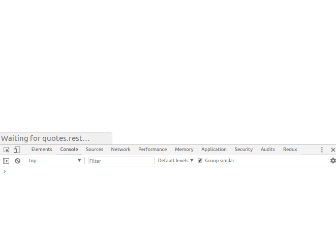

# angular-pluggable-architecture
This is an example of an Angular application that allows to dynamically plug functionality.

The application is a simple Dashboard with Widgets that are loaded
at runtime from external sources.

## To do
- Support production build with AOT.
- Widgets with separated template and css files should be compiled and inlined during the bundle build. Configure rollup to do that or use ng-packagr.

## References
- Developing with Angular, Denys Vuika.
https://github.com/DenisVuyka/developing-with-angular/tree/master/angular/plugins
- As busy as a bee — lazy loading in the Angular CLI, David Herges
https://blog.angularindepth.com/as-busy-as-a-bee-lazy-loading-in-the-angular-cli-d2812141637f
... how does lazy loading in the Angular CLI work under the hood?
- How to load dynamic external components into Angular application?
https://stackoverflow.com/questions/45503497/how-to-load-dynamic-external-components-into-angular-application/45506470#45506470
- Here is what you need to know about dynamic components in Angular, Maxim Koretskyi
https://blog.angularindepth.com/here-is-what-you-need-to-know-about-dynamic-components-in-angular-ac1e96167f9e
- Modules are not what you think they are, Maxim Koretskyi
https://youtu.be/pERhnBBae2k
- Extension mechanism demo
https://github.com/maximusk/extension-mechanism-demo
- JIT Complier needed with AOT Build for Dynamic Component.
https://github.com/angular/angular/issues/20875
